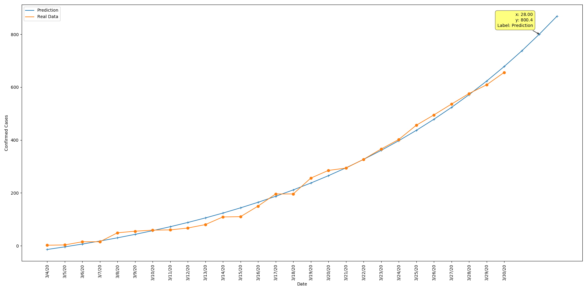
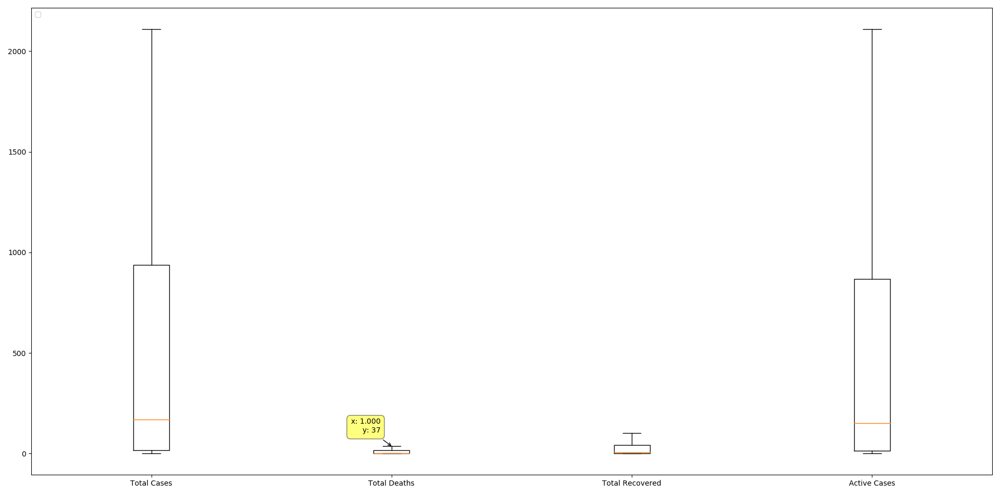
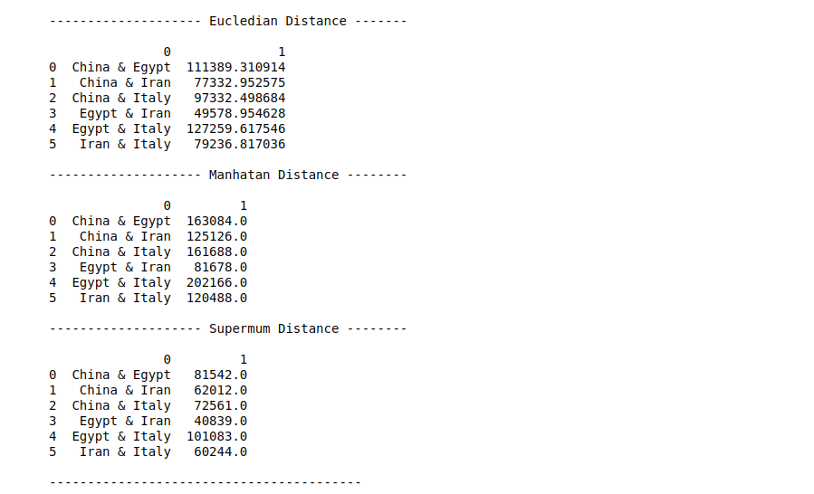
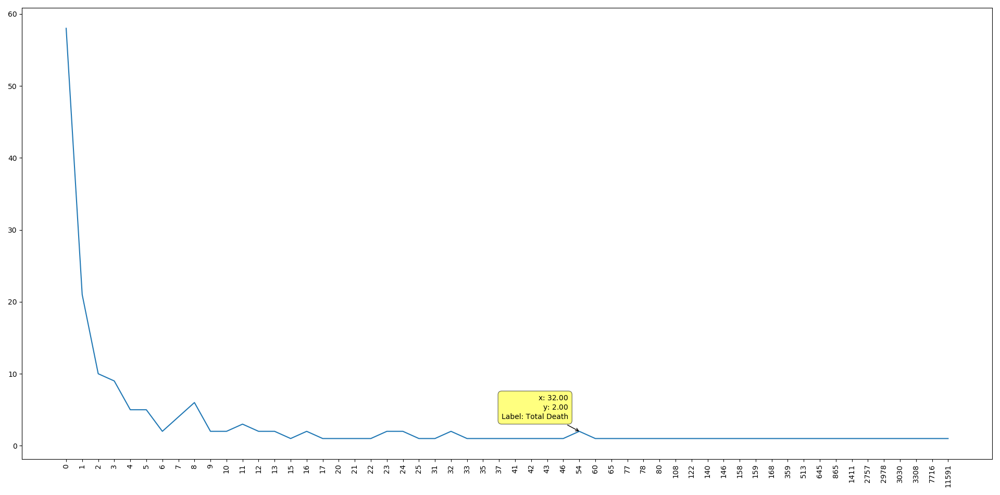
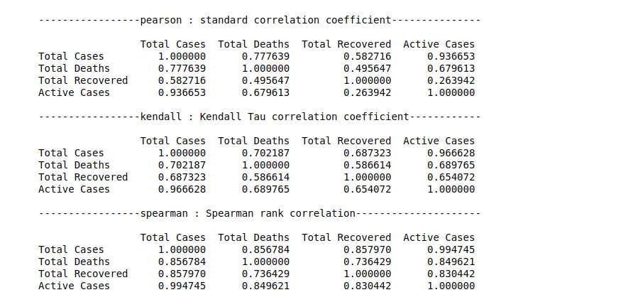

# COVID-19
Using COVID-19 Datasets From Johns Hopkins University Repository i did some analytics and visualisation which includes the following
- Grouping and Merging Data By Country instead of Province/State
- Visualizing Egypt's Confirmed Cases Progress and Making a Predictive Model For The Next 3 Days as an Exponential Growth

- Visualizing Boxblots of Total Confirmed, Recovered, Deaths & Active Cases World Wide

- Visualizing China's, Italy's, Iran's, Spain's & USA's Confirmed Cases Progress

- Calculating Similarities Between Total Confirmed, Recovered, Deaths & Active Cases Using Different Methods (Euclidean, Manhattan, Supermum)

- Calculating Skewness of Total Confirmed, Recovered, Deaths & Active Cases Data

- Calculating Correlation Between Total Confirmed, Recovered, Deaths & Active Cases Using Different Methods (Pearson, Kendall, Spearman)

-------------------------------------------------------------
Used Python with
- Pandas to Import & Manipulate the Data
- Matplotlib to Visualize the Data
- Scipy to Make Predictive Model
